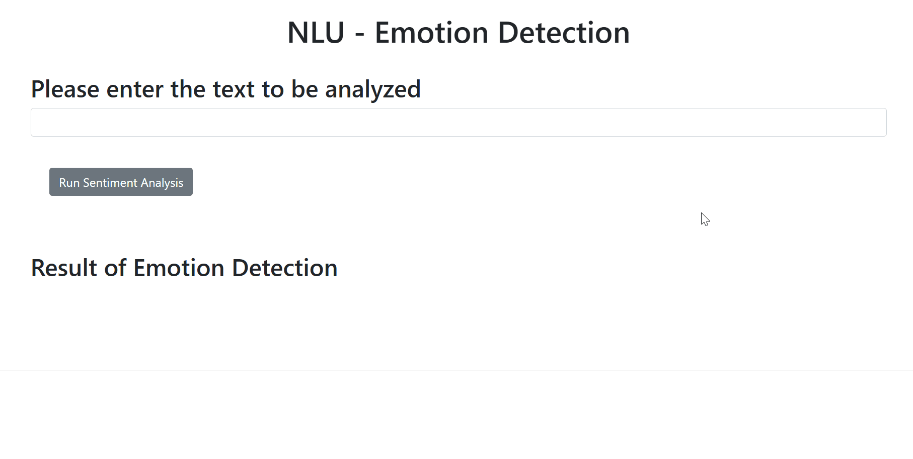

# emotion-detection
Emotion detection of the text using IBM Watson NLU API. It can detect the five different emotion scores of the text (sadness, joy, fear, disgust, and anger) and provide the dominant emotion.

## Demo

- User can input the sentence and it will detect the five different emotion scores of the text (sadness, joy, fear, disgust, and anger)
- Then it will detect the dominant emotion, the emotion with the highest score
- If the input is empty, it will displays 'invalid text'

## What I Learned
- Created an AI based emotion detection application using Watson NLU API.
- Formatted the output received from the Watson NLU API to extract relevant information from it.
- Packaged the application and made it importable to any python code for usage.
- Ran unit tests on the application and checked the validity of its outputs for different inputs.
- Get method for dictionary to extract each key (score) from emotions and assign to the respective emotion scores
- Max function for dictionary to find the dominant emotion, the emotion with the highest score
- Deployed the application using Flask framework.
- Incorporated error handling capability in the application where the input is empty and the server returns with 400 status code
